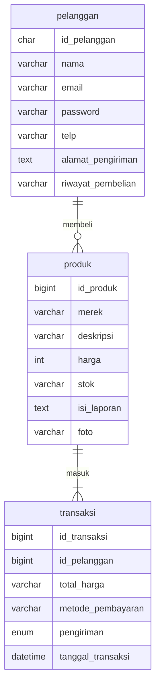
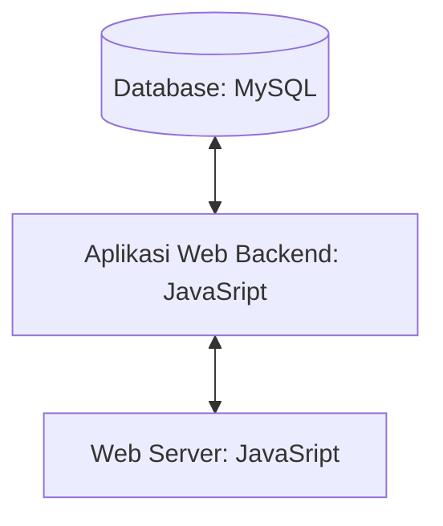

## 1.1 Latar Belakang
saya suka bermain sepak bola dan sepak bola adalah olaharaga yang terpopuler didunia,jadi alasan saya bikin bisnis ini adalah untuk mempermudah proses bisnis dengan pelanggan,tujuan dari bisnis ini diharapkan dapat memudahkan pelanggan dalam melakukan pembelian sepatu bola secara online dan memenuhi kebutuhan pelanggan yang mencari produk produk berkualitas tinggi dan bagus terkait sepatu sepak bola.

## 1.2. Deksripsi Teknologi Informasi

website e-commerce jualan sepatu sepakbola adalah sebuah platform digital yang memungkinkan pengguna untuk membeli sepatu olahraga atau sepak bola secara online. Tujuan dari website ini adalah untuk memberikan kemudahan bagi pengguna dalam membeli sepatu sepakbola tanpa harus pergi ke toko. website ini juga bertujuan untuk meningkatkan penjualan sepatu bola secara online.Selain itu, ini juga memungkinkan pengguna untuk memilih berbagai jenis sepatu sepakbola dari berbagai merek dan model yang tersedia. website ini juga dapat memberikan pengalaman belanja yang lebih nyaman dan aman bagi pengguna.

## 1.3. Branding
Merk : TotalFootball

tagline : Lengkapi Petualangan Sepak Bola Anda di Toko Kami.

campaign : toko Kami, Awal dari Setiap Petualangan Sepak Bola Anda

target user :

   - pencinta sepak bola

   - penggemar mode sepak bola

User experience theme :
   - sederhana
   - elegan
   - warna : dominan putih dan hijau
   - inspirasi design :
     

     
## 2. User Story
sebagai | saya ingin bisa | sehingga | prioritas
---|---|---|---
pelanggan | membeli produk | bisa memakainya | ⭐⭐⭐⭐⭐
pelanggan | menambah pesanan di keranjang | bisa membelinya lain waktu | ⭐⭐⭐⭐⭐
pelanggan | melihat katalog lengkap | bisa melihat katalog lengkap sepatu sport dengan deskripsi produk yang jelas | ⭐⭐⭐⭐⭐
pelanggan | membayar produk yang flesibel | bisa mendukung berbagai metode pembayaran, termasuk kartu kredit, transfer bank, dan pembayaran digital, untuk memudahkan proses pembelian | ⭐⭐⭐⭐
pelanggan | mencari produk | bisa dapat menggunakan fitur pencarian yang efektif untuk menemukan sepatu sport berdasarkan merek, jenis olahraga, ukuran, dan warna | ⭐⭐⭐⭐
pelanggan | memberikan ulasan dan penilaian | bisa membagikan pengalaman pengguna tentang produk tersebut | ⭐⭐⭐⭐
pelanggan | melihat ulasan dan penilaian | bisa membaca pengalaman pengguna lainnya dan melihat penilaian untuk setiap sepatu | ⭐⭐⭐⭐
pelanggan | mendapatkan pemberitahuan diskon dan promo| bisa menerima pemberitahuan tentang promo dan diskon eksklusif melalui notifikasi, serta dapat dengan mudah mengakses halaman penawaran khusus | ⭐⭐⭐⭐

## 3. Struktur Data

## 4. Arsitektur Sistem

## 5. Teknologi, Library, dan Framework

dalam pembuatan website ecommerce ini saya menggunakan beberapa teknologi informasi antara lain adalah:

1. Frontend saya menggunakan HTML,CSS,dan JAVASCRIPT Digunakan untuk membangun tata letak, desain, dan interaktivitas pada halaman web
2. Backend saya menggunakan JAVASCRIPT
   - JavaScript adalah bahasa pemrograman yang digunakan dalam pengembangan website agar lebih dinamis dan interaktif. Kalau sebelumnya kamu hanya mengenal HTML dan CSS, nah sekarang kamu jadi tahu bahwa JavaScript dapat meningkatkan fungsionalitas pada halaman web. Bahkan dengan JavaScript ini kamu bisa membuat aplikasi, tools, atau bahkan game pada web.JavaScript menjadi salah satu bahasa pemrograman yang sangat populer. Mengapa? Di tahun 2016 saja sudah ada sekitar 92% pembuatan web menggunakan JS, apalagi di tahun-tahun sekarang. Tentunya web yang dibuat dengan JS akan lebih dinamis dan interaktif. Banyak perusahaan top global yang sudah mengimplementasikan JS sebagai bahasa pemrograman andalannya. Kita bisa buktikan juga bahwa JS itu populer dan menjadi bahasa yang paling banyak digunakan di Github.fungsi JavaScript Selain membuat web jadi lebih dinamis dan interaktif, JS digunakan juga untuk proses logika data. “Intinya, fungsi JS tidak hanya soal urusan front end, tapi juga sekaligus dipakai untuk urusan back end,” imbuh developer.
4. dibagian Design saya menggunakan FIGMA
   - Figma adalah salah satu tools berbasis website yang digunakan untuk mendesain kapan saja dan dimanapun melalui internet. Pada umumnya Figma digunakan untuk mendesain interface dari sebuah aplikasi yang ingin dibuat. Dalam pengerjaan sebuah aplikasi baru, Figma dapat dimanfaatkan untuk membangun aplikasi tersebut bersama tim. Basis Operating System yang dapat menjalankan figma adalah Windows dan mac OS untuk desktop.Fitur dari Figma berfokus kepada desain terkait User Interface (UI) dan User Experience (UX). Tampilan dari aplikasi dan pengalaman bagi pengguna ketika menggunakan aplikasi didapat dari pengembangan aplikasi melalui Figma. Beberapa tools yang memiliki kemiripan seperti Figma adalah Sketch dan Adobe XD dan yang membedakannya hanya pada fitur.
6. Untuk programnya saya menggunakan VISUAL STUDIO CODE.
   - Visual Studio Code (VS Code) adalah editor source code buatan Microsoft yang beroperasi pada komputer desktop dan kompatibel dengan sistem operasi Windows, macOS, dan Linux. VS Code cocok untuk JavaScript, TypeScript, dan Node.js. Selain itu, editor ini memiliki ekosistem extension yang luas yang dapat mendukung berbagai bahasa pemrograman dan runtime lainnya, termasuk C++, C#, Java, Python, PHP, Go, dan .NET. Karena serbaguna dan memiliki extension yang beragam, Visual Studio Code menjadi pilihan populer di kalangan developer untuk beragam tugas pemrograman.
8. dan Operasi computer saya menggunakan WINDOWS
   - Sistem operasi Windows adalah sebuah program komputer yang mengatur semua sumber daya komputer dan menyediakan layanan kepada aplikasi yang berjalan di atasnya. Sistem operasi ini dikembangkan oleh perusahaan Microsoft dan dirilis pada tahun 1985 dengan nama Windows 1.0. Sejak saat itu, sistem operasi Windows terus berkembang dan menjadi salah satu sistem operasi paling populer di dunia.  Sistem operasi Windows dirancang untuk berjalan pada berbagai jenis perangkat keras, termasuk desktop, laptop, server, dan perangkat mobile. Windows menggunakan antarmuka pengguna grafis (GUI) yang memungkinkan pengguna untuk berinteraksi dengan komputer melalui ikon, tombol, dan menu visual, daripada menggunakan perintah teks seperti sistem operasi lain. Windows juga memiliki banyak fitur seperti kemampuan multitasking, yang memungkinkan beberapa aplikasi berjalan secara bersamaan, serta kemampuan plug-and-play yang memudahkan pengguna dalam menghubungkan perangkat tambahan seperti printer, scanner, dan kamera. 

## 6. Desain User Experience dan User Interface
link figma : https://www.figma.com/file/7i6KbebV6AkEVyqdEkhVJm/PI?type=design&node-id=0%3A1&mode=design&t=Tjsp9V9FzgIEruj1-1
  tampilan awal
- 

## 7. Demonstrasi Video

https://youtu.be/qYFjkqsNJLE

## 8. Bagaimana mesin komputasi dan sistem operasi berperan dalam produk teknologi informasimu ?
https://youtu.be/qYFjkqsNJLE

Mesin komputasi dan sistem operasi berperan penting dalam teknologi informasi atau website yang saya buat. Mesin komputasi menyediakan perangkat keras yang diperlukan untuk menjalankan program-program yang diperlukan untuk membuat dan mengelola website. Sistem operasi menyediakan lingkungan yang memungkinkan program-program tersebut untuk berjalan.

Secara khusus, mesin komputasi menyediakan komponen-komponen berikut yang diperlukan:

-  Prosesor: Prosesor adalah otak dari mesin komputasi. Ini bertanggung jawab untuk menjalankan program-program yang diperlukan untuk membuat dan mengelola website.
-  Memori: Memori menyimpan data yang diperlukan untuk menjalankan program-program tersebut.
-  Penyimpanan: Penyimpanan menyimpan kode dan data website.
-  Kartu grafis: Kartu grafis bertanggung jawab untuk menampilkan halaman web di layar.

di Sistem operasi juga menyediakan layanan-layanan yang akan membantu kita seperti:
-  Manajemen file: Sistem operasi mengelola file-file yang disimpan di penyimpanan. Ini memungkinkan program-program untuk mengakses file-file tersebut dengan mudah.
-  Manajemen memori: Sistem operasi mengelola memori yang tersedia di mesin komputasi. Ini memastikan bahwa program-program memiliki akses ke memori yang mereka butuhkan untuk berjalan.
-  Manajemen proses: Sistem operasi mengelola proses-proses yang berjalan di mesin komputasi. Ini memastikan bahwa proses-proses tersebut berjalan dengan lancar dan tidak saling mengganggu.
-  Keamanan: Sistem operasi menyediakan layanan keamanan yang melindungi website dari serangan.
Selain itu, mesin komputasi dan sistem operasi juga berperan penting dalam proses pengembangan website. Mesin komputasi menyediakan lingkungan yang memungkinkan pengembang website untuk menulis kode dan mengujinya. Sistem operasi menyediakan alat-alat yang dapat digunakan oleh pengembang website untuk membuat website.
## 9. Bagaimana algoritma, struktur data, dan bahasa pemrograman berperan dalam produk teknologi informasimu ?
https://youtu.be/qYFjkqsNJLE
Algoritma adalah langkah-langkah yang digunakan untuk menyelesaikan suatu masalah. Algoritma berperan penting dalam pembuatan website karena digunakan untuk menentukan bagaimana website akan berfungsi. 
struktur data adalah cara untuk menyimpan dan mengatur data. Struktur data berperan penting dalam pembuatan website yang saya buat karena digunakan untuk menyimpan data yang diperlukan untuk menjalankan website atau produk teknologi informasi.
Bahasa pemrograman adalah bahasa yang digunakan untuk menulis kode komputer. Bahasa pemrograman berperan penting dalam pembuatan website yang saya buatkan karena digunakan untuk menulis kode yang menentukan bagaimana website akan berfungsi. Misalnya, bahasa pemrograman digunakan untuk menulis kode HTML, CSS, dan JavaScript yang membentuk halaman web, serta kode untuk mengakses database dan memproses data.
## 10. Bagaimana metode pengembangan perangkat lunak / Software Development Life Cycle berperan dalam produk teknologi informasimu ?
https://youtu.be/qYFjkqsNJLE
untuk dibagian ini Metode pengembangan perangkat lunak, atau Software Development Life Cycle atau (SDLC), berperan penting dalam produk teknologi informasi, termasuk website yang saya akan buat.SDLC adalah proses yang digunakan untuk mengembangkan perangkat lunak, mulai dari perencanaan hingga pemeliharaan.

SDLC terdiri dari beberapa tahap, yaitu:
-  Perencanaan (planning): Tahap ini mencakup identifikasi kebutuhan pengguna, analisis persyaratan, dan penyusunan rencana pengembangan.
-  Analisis (analysis): Tahap ini mencakup studi kelayakan, analisis sistem, dan analisis kebutuhan pengguna.
-  Desain (design): Tahap ini mencakup perancangan arsitektur, perancangan antarmuka pengguna, dan perancangan database.
-  Implementasi (implementation): Tahap ini mencakup penulisan kode, pengujian, dan deployment.
-  Pemeliharaan (maintenance): Tahap ini mencakup perbaikan bug, peningkatan fitur, dan perubahan kebutuhan.
## 11. Bagaimana database / sistem basis data berperan dalam produk teknologi informasimu ?
https://youtu.be/qYFjkqsNJLE
Database atau sistem basis data berperan penting dalam produk teknologi informasi. Database adalah kumpulan data yang saling berhubungan, yang disimpan secara terorganisir dan dapat diakses dengan mudah. Database digunakan untuk menyimpan data yang diperlukan untuk menjalankan website, seperti
-  Data pengguna: Data pengguna meliputi nama, alamat email, alamat pengiriman, dan informasi lainnya.
-  Data produk: Data produk meliputi nama, harga, deskripsi, dan gambar produk.
-  Data transaksi: Data transaksi meliputi informasi tentang pembelian produk, seperti tanggal, jumlah, dan harga.

Database memungkinkan website untuk menyimpan data ini secara efisien dan mudah diakses. Hal ini penting karena data tersebut diperlukan untuk berbagai fungsi website, seperti:
-  Otentikasi pengguna: Website menggunakan data pengguna untuk memverifikasi identitas pengguna saat mereka masuk.
-  Pemrosesan pesanan: Website menggunakan data produk dan transaksi untuk memproses pesanan pengguna.
-  Pencarian: Website menggunakan data produk untuk memungkinkan pengguna mencari produk yang mereka inginkan.
Secara keseluruhan, database merupakan komponen penting dalam produk teknologi informasi, termasuk website. Database membantu website untuk menyimpan data secara efisien dan mudah diakses, yang memungkinkan website untuk berfungsi dengan baik dan memenuhi kebutuhan pengguna.
